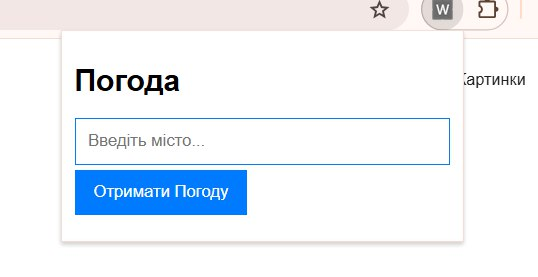
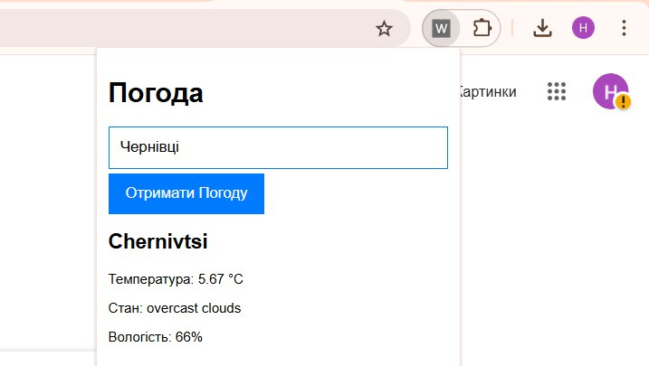

# Розширення "Погода"

Це Chrome-розширення дозволяє користувачам швидко дізнатися поточну погоду у вибраному місті. Використовуючи API OpenWeatherMap, розширення отримує та відображає основну інформацію про погоду, таку як температура, опис погоди, вологість та інше.

## Функціонал

- **Введення міста**: Користувач може ввести будь-яке місто у поле вводу, щоб дізнатися погоду в цьому місці.
- **Отримання погоди**: Після введення міста натискається кнопка "Отримати Погоду", і розширення звертається до API для отримання даних.
- **Відображення результатів**: Погода відображається на екрані у зручному форматі.
- **Обробка помилок**: Якщо місто не знайдено або виникла інша помилка, розширення покаже повідомлення про помилку.

## Демонстрація роботи розширення

Головний інтерфейс розширення:

Отримання інформації про погоду:

## Вимоги

Для коректної роботи розширення потрібен API ключ OpenWeatherMap. Вставте ваш API ключ у `index.js`.

## Як користуватися

1. Встановіть розширення в Chrome.
2. Відкрийте розширення і введіть назву міста.
3. Натисніть кнопку "Отримати Погоду" для отримання актуальної інформації про погоду.
